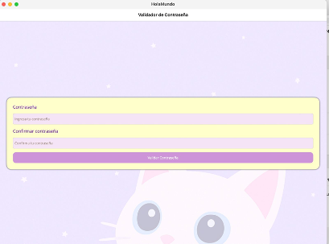

# Validador de Contraseña - .NET MAUI

Este proyecto es un **formulario simple** desarrollado con **.NET MAUI** para validar contraseñas. Verifica que ambas contraseñas coincidan y cumplan con los requisitos mínimos de seguridad.

## 👩‍💻 Desarrollado por:
**Barbara Monserrat Rebollar Casillas**  
_CIBERINFRAESTRUCTURA 2025-A_  
**Ma. Inés Calderón Zetter**

---

## 🚀 Funcionalidad

✅ Coincidencia de contraseñas  
✅ Reglas de seguridad:
- Al menos **8 caracteres**
- Al menos **una letra mayúscula**
- Al menos **una letra minúscula**
- Al menos **un número**

---

## 🧪 Capturas de pantalla

### 🟣 Pantalla inicial


### ❌ Contraseñas no coinciden


### ⚠️ Contraseña inválida


### ✅ Validación exitosa


---

## 📄 Código relevante comentado

### MainPage.xaml.cs

```csharp
// Constructor que inicializa los componentes de la vista
public MainPage()
{
    InitializeComponent();
    PasswordEntry.Text = string.Empty;
    ConfirmPasswordEntry.Text = string.Empty;
}

// Evento que se activa al dar clic en el botón
private void OnValidatePasswordClicked(object sender, EventArgs e)
{
    string password = PasswordEntry.Text;
    string confirmPassword = ConfirmPasswordEntry.Text;

    if (password != confirmPassword)
    {
        DisplayAlert("Error", "Las contraseñas no coinciden.", "OK");
        return;
    }

    // Reglas: mínimo 8 caracteres, una mayúscula, una minúscula, un número
    string pattern = @"^(?=.*[a-z])(?=.*[A-Z])(?=.*\d).{8,}$";

    if (Regex.IsMatch(password, pattern))
    {
        DisplayAlert("Éxito", "La contraseña es válida y coincide.", "OK");
    }
    else
    {
        DisplayAlert("Inválido", "Debe tener al menos 8 caracteres, una mayúscula, una minúscula y un número.", "OK");
    }
}
